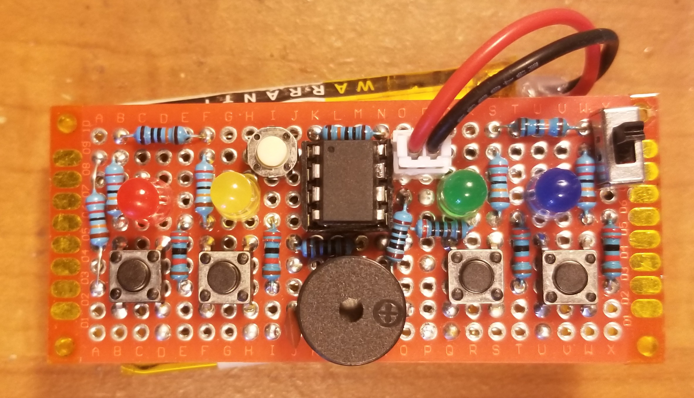
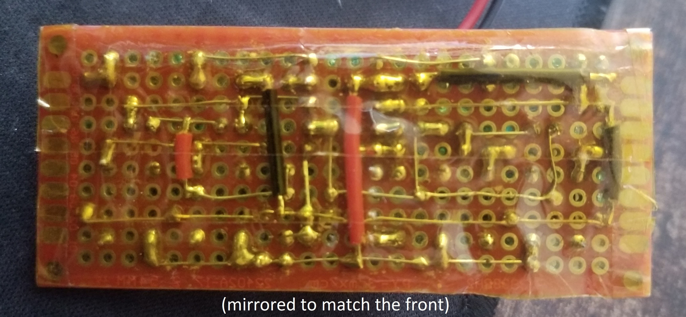

# tiny-simon
Enhanced Simon Says: difficulty levels and built-in audio frequency
generator

This repo is designed to help people learn how to design something 
like this, both hardware and software. I hope that this can help others
with understanding basic circuit and code ideas that can be put together 
to make great things.

In the , you can learn much more about:
- Registers controlling the clock, ADC, digital IO, and timers
- Psuedorandom number generators based on LFSRs
- Timer output compare outputs, and the capabilities of Timer1 in general
- Multiplexing and Charlieplexing LEDs
- R2R Digital-to-Analog converters
- This project's schematic

# Compilation and Loading:

I used the Arduino IDE to upload this to an ATTINY85 using ISP and
Spence Konde's Attinycore, using these settings:

- Board: "ATtiny25/45/85 (No Bootloader)"
- Chip: "Attiny85"
- Clock: "8MHz (internal)"
- B.O.D.: "B.O.D. disabled"
- Timer 1 Clock: "CPU"
- millis()/micros(): "disabled"

The compiled binary is 1360B, allowing usage on even the ATTINY25. Since the 
code makes use of Timer1, which is pretty much unique to the 'X5 family, 
it will only work on those. You should probably just use an '85, since it is 
barely more expensive than a '25 or '45 and with much more flash/RAM.

# Assembly and programming notes:

This project can be built on a 10x24 PTH protoboard, available straight
from China for cheap from many retailers, including Amazon.

- The OSCCAL register must be programmed PER-CHIP if a high accuracy 
frequency generator is needed. An easy way is to compare the tone generated
to a known accurate audio source, like a PC or smartphone, or maybe you
have a laboratory frequency generator. Lucky you.

# Usage notes:

- When you turn on the circuit (via the switch or other means) nothing
will happen. The uC is waiting for you to press a button before it will
act. The first three buttons start a Simon game, with different
difficulties:

  - The first button starts a normal game. Nothing is special, each round
adds one cue, and the game never speeds up. The button sounds make a major
chord.

  - The second button starts a hard game. Every other round adds two cues
instead of one, and the game speeds up slightly. The button sounds make a
minor chord.
 
  - The third button starts an impossible game. Each round adds two cues,
the game speeds up quickly, and occasionally a previous cue will change
to something else, messing with memorization. The button sounds are random.

- The fourth button starts the audio frequency generator. After a short
fanfare, the buzzer will begin emitting well-tempered C4, or around 262Hz.
The buttons will change the pitch one octave down, one semitone down, one
semitone up, and one octave up respectively, as long as the frequency remains
within the limits (C2-C7). If the frequency did change, i.e. it didn't hit a
limit, the corresponding LED will blink. There is no way to exit except by
resetting the uC. Sorry.
