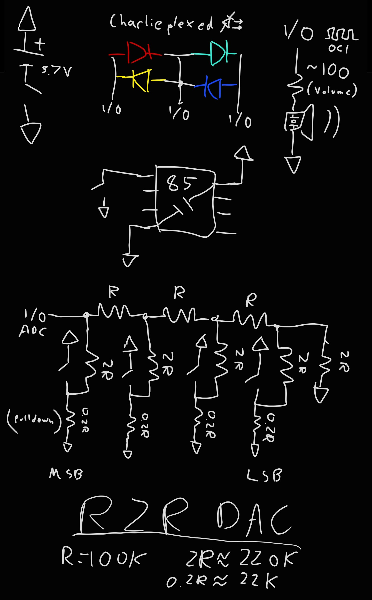

# Design Notes:

## The Software

- The software is quite simple here. First, the main method sets a bunch 
of registers to the configurations we need; this would be the setup() method:

  - OSCCAL controls the clock frequency, this should be changed to make the 
  frequency generator more accurate. If you do not care about 440Hz actually 
  being 440Hz this can be left out; Microchip guarantees that the clock is no
  more than 10% inaccurate anyway.
  - DDRB, the Data Direction register, controls whether the output driver is 
  turned on or off for each pin. Here, only pin1 should be an output, so we set
  the first bit from the right, starting from zero.
  - ADMUX, the ADC multiplex register, controls what the reference volltage and
  inputs to the ADC should be. Here, we want the ADC to be able to measure 
  voltages all the way up to Vcc, so set the reference voltage to that by setting
  bits 7, 6, and 4 to zero. Also, the input will be on pin 2 for me, so I set that.
  Additionally, for convenience we make use of the ADC left adjust feature, which 
  allows an 8-bit reading to be made just by reading one register instead of two.
  - ADCSRA, the ADC control register, controls whether the ADC is on, and sets its
  clock prescaler. Obviously, we want the ADC to be on, so set that bit. Also, the 
  system clock will run at approximately 8MHz, and the ADC is recommended to run at 
  50-200kHz. However, since we only want up to only 5 bit precision anyway, running 
  it at the much higher 1MHz is perfectly fine. Set the prescaler to 8 to achieve 
  this.
  - DIDR0, the Digital Input Buffer register, controls whether the digital input 
  buffer is active for each pin. This is necessary to read digital inputs, but since
  our software never needs this, simply turn them off for all 5 I/O pins. This saves
  a bit of power.
  - PRR, the Power Reduction register, can turn off various peripherals to save 
  power. We for sure don't need the Universal Serial Interface, so just turn that off.
  
- Next is the loop() section that repeats forever. First, buttonInput() is called, 
which returns an int based on which button you press. Let's look at that.

  - buttonInput has a parameter wantNone; that will show up later, and you call with 
  that true if you want to block until no button is pressed. Some int declarations are 
  made, including stability, which is important. polledInput will be the button the 
  function thinks you have been pressing, and newInput will be its newest guess.
  - While stability is less than 100 (which it will be at the beginning), ADCSRA is 
  toggled to start an ADC reading. When it is finished the bit will toggle back, so 
  wait for that. 
  - Now, read the upper 8 bits of the ADC, and use just the high 5 bits of that. This
  automatically throws out a lot of noise, since 32 values of the 10-bit output will 
  all have the same 5-bit output. 
  - newInput is set to some arbitrary negative number. If there were no buttons pressed
  newInput would be -1, and if there were, newInput would be even lower. However, the 
  next few lines set newInput to the appropriate positive number if the 5-bit reading
  indicates just one button is pressed.
  - This all repeats until there is enough stability in the reading, and any of these 
  three conditions will reset the stability to 0: If wantNone is false and the newInput 
  is a negative number indicating that not just one button was pressed, or none were; if 
  wantNone is true and newInput is not -1 indicating that at least one button was pressed;
  if polledInput - the running guess for which button you pushed, and newInput are not 
  equal. In any of these cases the stability is reset to 0, and additionally polledInput 
  is set to newInput, the newer guess. Only if newInput matches polledInput for at least 
  100 cycles will this function return.
  - Finally, call randomLite(). This is done because randomLite really is not very random
  by itself. However, considering that there is no telling exactly how many times buttonInput 
  will cycle looking for high enough stability, that is the source of randomness.
  
- Now that buttonInput() has returned a number, main() must do something with that. If this 
number is 3, then the last button was pushed, so the frequency generator should start. 
Otherwise, a game of Simon should start. Let's look at simon().

  - simon() takes a parameter difficulty, which is 0, 1, or 2. First, create an array of
  many ints that stores the Simon sequence that must be repeated by the player.
  - Next, the notes that play when each button is pressed are decided. In easy mode, they 
  make up a major triad, and in hard mode, a minor triad created by subtracting 1 from the 
  second note. In impossible mode, the notes are pretty much random.
  - To finish up the intro, the intro fanfare is played, clueing in the player to which note
  goes with which light.
  
  - An initial value is placed into simonSequence[], and the score was set to 1; the score 
  indicates where in the simonSequence the next light should go. For example, if the score 
  is 25, then the first 25 elements are already set, and the next one should go into \[25\].
  - Until the score overflows to 0, play on; The next light in the sequence is first decided.
  I made the sequence have no repeats, but that is not necessary.
  - Now, see if the call-response should be skipped this round. In harder difficulties, 
  occasionally you will have to remember two more lights at a time, not just one. By
  skipping call-response and moving on to setting the next light, this is possible.
  - Next, mutation is performed. In impossible mode the sequence can change! A random light 
  somewhere in the middle of the sequence is picked. Sometimes, it is changed to a different 
  light, messing with the player's memory.
  - Next, the call is performed. In sequence, the lights are lit and the notes sound, with each
  round going faster than the last. Then the function waits for no button to be pressed
  - The response begins; the player must push the correct buttons in sequence. If the button 
  pushed is correct the corresponding light is lit and the buzzer sounds for a while. If at any
  time the input is incorrect, then the game ends with a fail sound. 
  - If the response was passed successfully, the score increases and the next round is started.
  This loops until score = 0, or an overflow.
 
- Now, freq().
  
  - A starting fanfare indicates that the frequency generator is starting up.
  - Now a starting note number is defined;
  - Starting from here is a loop. The buzzer output is updated, then wait for no button pressed.
  - The highest bit of noteNumber is used as a flag to see if a button press actually changed
  the note. This equivalent to adding 128.
  - Wait for a button press, then depending on the button change octave down (-12), semitone 
  down (-1), semitone up, octave up. Note that at this point noteNumber is bounded by 0+128 
  below and 72+128 = 200 above. If the bounds would be exceeded by this change then no change 
  is performed, and the high bit stays high. If the change can be done then the high bit is 
  cleared, in addition to the necessary change in noteNumber.
  - Now, if there was a successful change, the correct light is lit.

- Some other support functions give output. ledOutput() simply makes the necessary changes to
DDRB and PORTB to set each pin high or low or high impedance to make the correct LED light. 
- playNote() relies on timer1. Timer1 on the ATTINYX5 is superbly suited to playing a wide range
of notes because of its prescaler that supports divisors of 2 all the way to 16384.
  
  - A prescaler divides the CPU clock frequency into the timer1 frequency, for example if 
  the CPU clock is 8MHz and the prescaler is 1024, then the timer will tick at 8kHz.
  - Timer1 on the 'X5 has many capabilities. One mode it can run in is CTC mode or Clear Timer on 
  Compare, in which when the timer count reaches the Output Compare Register timer1 C, or OCR1C, 
  it resets back to 0. If OCR1C is set to different values, then the counter will reset at 
  different frequencies. 
  - Timer1 can also change the state of a pin if OC1X is enabled. We use it here to toggle the 
  OC1A line, or pin1, when the compare match resets Timer1. 
  
  - The OCR1C values are chosen in a geometric sequence from 128 to 255, with 12 steps, one for
  each note in the chromatic scale. There should be no values much less than 128, since those
  frequencies would be better represented by decrementing the prescaler exponent, and doubling
  the timer frequency anyway.
 
 - The actual code of playNote():
 
  - The noteNumber is divided by 12 to find which prescaler should be used to create the correct
  frequency, remembering that a prescaler exponent of 1 is fastest and of 15 is slowest. A value of
  0 stops note output, so if the noteNumber was -1 then the prescaler exponent would remain 0.
  - If the prescaler expoennt is 0, then DDRB is changed to disable output on pin1, else it is 
  enabled.
  - OCR1C is set to the correct value, reading from flash instead of storing the table in precious
  RAM.
  - And finally, TCCR1, the Timer Control Register 1, is set to enable in CTC mode and active the 
  PWM output on OC1A or pin1, as well as setting the prescaler exponent correctly.
  
 - Finally, there is randomLite(). It uses a Linear Feedback Shift Register.

  - A shift register is a series of cascaded d-type flip flops. When the clock is strobed, each 
  flip flop passes its output to the next one. The first flip flop will take its input from the 
  overall input, and usually the last flip flop's output is trashed.
  - The linear feedback is how the overall input is decided. It turns out that XORing the correct
  flip flop outputs and feeding the result back into the 8-bit shift register can cause the
  register to scan through every value from 1 to 127 in a seemingly random order. Of course, this
  is not actually random, but it sure looks like it with few enough inspections.
  -In software, the shift register is a byte that is bit-shifted right constantly. The MSB is then 
  set to the XOR result of a few of the bits inside the register, in this case bits 5,2,1, and 0. 
  - buttonInput() calls this constantly while scanning the buttons, so randomLite() is called an 
  unpredictable number of times. An unpredictable number of shifts and feedbacks happen causing 
  the output to be random enough for a Simon game.
  - Some arithmetic is done to make the output fall between the supplied bounds.

## The Hardware

### The Microcontroller

- Just remember to include a reset button

### The Buzzer output

- The resistor in series with the piezo buzzer controls its loudness.
Don't set the resistance too low, or the uC will be damaged. There is
no amplifier to boost the signal coming from the uC pin.

- The buzzing is created by a Timer1 compare match output, so the buzzer 
output pin must either be pin 1 or 4. Alternatively, generating it with 
timer interrupts would allow any pin to serve as the buzzer output, at the 
cost of some speed.

### The LED output

- Powering arbitrary combinations of many LEDS with few pins requires some 
clever wiring; one pin to each LED will not work!
- One way to do this is multiplexing, to have the LEDs in a grid, with columns of anodes
and rows of cathodes. If the anode pins are sent high one by one (all the others 
staying low), during the time each column is high the correct cathode pins can 
go low (all the other ones staying high), turning on specific LEDs in each column.
If the columns are scanned fast enough it looks like any arbitrary pattern in the 
whole grid can be lit at once, even though this is not really the case.
- Microcontroller pins are usually not 2-state, but 3-state. They can additionally
go high-impedance, not letting any current in or out. This allows for even more LEDs
to be driven with the same number of pins. One way to do this is called charlieplexing,
where an LED is placed between every pair of two pins, one in each direction. To light
up any one LED, its anode pin is high and its cathode pin low, every other pin high-Z.
If the forward voltage of at least two LEDs in series is higher than the supply voltage,
only that one LED will light. Once again, the selected anode and cathode pins can be 
scanned to produce arbitrary patterns of LEDs, but since our application only requires 
one LED to be on at a time, simply setting the pins once is enough. This way, the three
used pins can control up to 6 LEDs, but we only use 4.

### The button input

- The 4-button keypad works as a discrete R2R DAC.
An R2R DAC is a very simple way to convert digital signals into an 
analog voltage. Each of the 16 different combinations of buttons pressed 
creates a diffferent voltage at the output, representable like in binary.
For example, starting from the MSB, the button pattern 1010 creates a voltage 
approximately 10/16 of the supply voltage. 

- Ideally, the buttons are SPDT, with the other throw connecting the 2R 
resistor to ground. Since most momentary button switches are SPST, however 
I added pulldown resistors with a value of 0.2R, to simulate a ground 
potential. This hurts the accuracy, but not enough to matter.

- To decrease the current flowing through the bias resistors, they are
all in the 100kOhm range, meaning that the resistance across your skin
will completely mess up the readings/buttons if you touch the analog traces.
This is why the picture shows the back completely covered by kapton tape.
Putting the entire board inside an enclosure is also a good idea.

### The power source

- Power the board from 3-6V. Any lower, and the lower wavelength LEDs
will not light up. Any higher and the uC might be damaged. A 1S Li-Ion
cell is perfect, which is why my board included a JST PH 2pin connector
to connect it. Mind the polarity!

- The switch is included because otherwise the microcontroller by itself 
will draw about 5mA. This could be reduced by forcing it into sleep modes.
